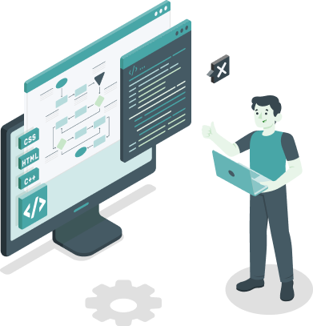
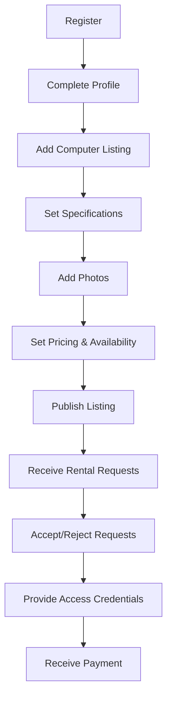
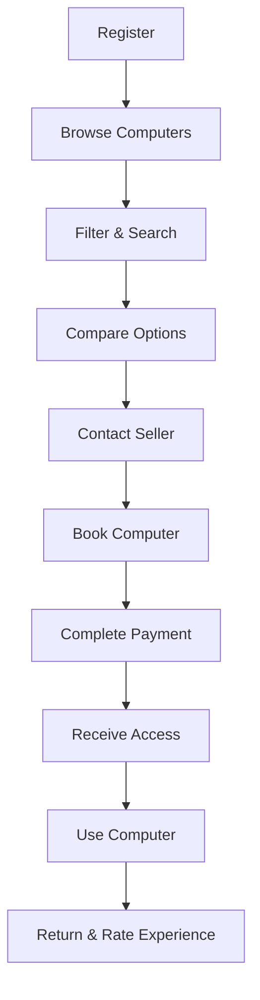

# CloudComputeMarketPlace - Presentation Guide

## Project Overview

CloudComputeMarketPlace is a revolutionary peer-to-peer platform that connects computer owners with individuals and businesses seeking high-performance computing resources. Our platform enables efficient utilization of computing power through a secure, user-friendly marketplace.

## Key Visuals for Presentation

### 1. Logo and Brand Identity

The CloudComputeMarketPlace logo represents our core values: 
- **Connectivity** between resource owners and users
- **Performance** of high-end computing 
- **Security** for all transactions
- **Accessibility** for users of all technical backgrounds

### 2. Value Proposition

#### For Computer Owners
- ✅ Generate passive income from idle computing resources
- ✅ Set your own pricing and availability
- ✅ Securely share access with qualified renters

#### For Computer Renters
- ✅ Access high-performance computing without large capital investments
- ✅ Choose from a variety of specialized hardware configurations
- ✅ Pay only for the time you need

### 3. Core Features Showcase

#### User-friendly Marketplace

The marketplace dashboard provides an intuitive interface for browsing available computers with advanced filtering options:
- Search by specifications (CPU, GPU, RAM)
- Filter by use case categories
- Sort by pricing, ratings, or location

#### Detailed Computer Listings

Each computer listing displays comprehensive information:
- High-resolution photos of the hardware
- Detailed specifications and benchmarks
- Availability calendar
- Pricing options (hourly, daily, weekly, monthly)
- Owner ratings and reviews
- Usage recommendations

#### Secure Messaging System

Our built-in messaging system facilitates seamless communication:
- Direct conversations between renters and owners
- Ability to discuss requirements and details
- File sharing for specifications or instructions
- Notification system for new messages

#### Simplified Rental Process

1. **Browse & Select**: Find the perfect computer for your needs
2. **Book**: Reserve the computer for your required timeframe
3. **Pay**: Complete secure payment through our platform
4. **Access**: Receive remote access credentials
5. **Use**: Connect and utilize the computing power
6. **Return**: Automatically released after rental period ends

### 4. User Workflows

#### Seller Journey

#### Buyer Journey

### 5. Technology Stack

Our platform leverages modern technologies for optimal performance:

- **Frontend**: React.js with Vite, modern CSS
- **Backend**: Node.js with Express
- **Database**: MongoDB for flexible data storage
- **Authentication**: JWT-based secure authentication
- **Cloud Infrastructure**: AWS/Azure for scalability

### 6. Key Metrics & Analytics

Present these key performance indicators:

1. **User Growth**: Monthly active users chart
2. **Transaction Volume**: Total rental value by month
3. **Computer Categories**: Distribution of computer types
4. **User Satisfaction**: Average ratings for transactions
5. **Platform Utilization**: Percentage of listed computers being rented

### 7. Market Opportunity

**Global Cloud Computing Market Size:**
- 2022: $545.8 Billion
- 2023: $626.4 Billion
- 2024: $718.1 Billion
- 2025: $832.1 Billion

**Key Market Segments:**
- AI & Machine Learning: 28%
- 3D Rendering: 17%
- Scientific Computing: 15%
- Data Analysis: 12%
- Software Development: 10%
- Others: 18%

### 8. Competitive Advantages

1. **Peer-to-Peer Model**: Direct connection between owners and renters
2. **Specialized Hardware**: Access to configurations not available in traditional cloud services
3. **Flexible Pricing**: Multiple pricing models to suit different needs
4. **Community Focus**: Ratings and reviews build trust in the marketplace
5. **Low Overhead**: Competitive pricing compared to enterprise cloud solutions

### 9. Future Roadmap

Highlight these upcoming features:

1. **Q3 2023**: Mobile applications for iOS and Android
2. **Q4 2023**: Real-time messaging with WebSockets
3. **Q1 2024**: Blockchain-based payment system
4. **Q2 2024**: AI-powered pricing optimization
5. **Q3 2024**: Virtual machine image templates for instant setup
6. **Q4 2024**: Hardware verification and benchmarking service

### 10. Demo Script

#### Introduction (1 minute)
"CloudComputeMarketPlace is revolutionizing access to computing resources by creating a sharing economy for high-performance computers..."

#### Dashboard Demo (2 minutes)
"As you can see, our intuitive dashboard provides a clean overview of available computers. Let me show you how easy it is to filter by specifications..."

#### Computer Listing Demo (2 minutes)
"Each computer listing provides detailed specifications and transparent pricing options. Let me walk you through an example of a high-performance GPU server..."

#### Rental Process Demo (3 minutes)
"The rental process is designed to be simple and secure. Let me demonstrate how a user would find and rent a computer..."

#### Messaging Demo (1 minute)
"Our built-in messaging system allows seamless communication between owners and renters. Here's how a typical conversation might unfold..."

#### Conclusion (1 minute)
"CloudComputeMarketPlace is well-positioned to capture a significant share of the growing cloud computing market by focusing on peer-to-peer connections and specialized hardware access..."

## Presentation Tips

### Visual Presentation

1. **Use High-Quality Screenshots**: Include real platform screenshots in your slides
2. **Consistent Branding**: Maintain color scheme and typography across all slides
3. **Data Visualization**: Use charts and graphs for metrics and market data
4. **Workflow Diagrams**: Visual representations of user journeys
5. **Product Demo Video**: Consider including a short (30-60 second) demo video

### Verbal Presentation

1. **Start with the Problem**: Begin by describing the challenge of accessing specialized computing resources
2. **Focus on Benefits**: Emphasize how the platform helps both owners and renters
3. **Tell User Stories**: Share examples of how different users benefit from the platform
4. **Address Security Concerns**: Proactively explain security measures
5. **Quantify the Opportunity**: Use market data to illustrate the potential

### Q&A Preparation

Prepare answers for these common questions:

1. **Security**: "How do you ensure security for computer owners?"
2. **Pricing Model**: "How does your fee structure work?"
3. **Market Differentiation**: "What makes you different from AWS/Azure/Google Cloud?"
4. **Technical Support**: "What happens if there are technical issues during a rental?"
5. **Scaling Plans**: "How will you acquire both supply (computers) and demand (renters)?"

## Slide Deck Structure

1. **Title Slide**: Logo, project name, tagline
2. **Problem Statement**: The challenge of accessing specialized computing resources
3. **Solution Overview**: How CloudComputeMarketPlace addresses the problem
4. **Market Opportunity**: Size and growth of the relevant market
5. **Platform Demo**: Screenshots or live demonstration
6. **Core Features**: Key functionality of the platform
7. **Business Model**: How the platform generates revenue
8. **Traction & Metrics**: Current usage and growth statistics
9. **Roadmap**: Future development plans
10. **Team**: Key team members and their expertise
11. **Conclusion**: Call to action and contact information

## Presentation Materials Checklist

- [ ] Slide Deck (PowerPoint/Keynote/Google Slides)
- [ ] Demo Environment (Staging or Production)
- [ ] Product Video (30-60 seconds)
- [ ] Technical Architecture Diagram
- [ ] User Journey Maps
- [ ] Market Research Data
- [ ] Business Metrics Dashboard
- [ ] Team Profiles
- [ ] Contact Information & Next Steps

---

This guide provides a comprehensive framework for creating a compelling presentation about the CloudComputeMarketPlace platform. Adapt and customize these elements to fit your specific audience and presentation goals.
